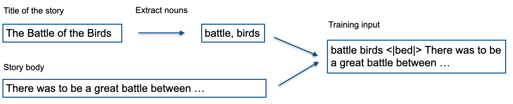
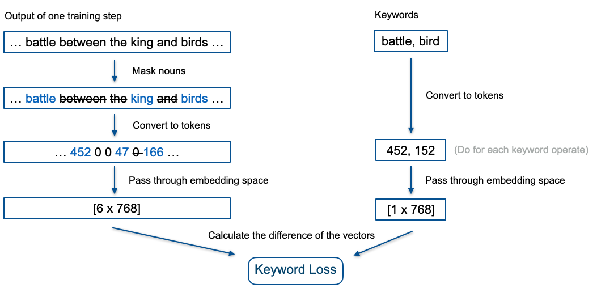

# Bedtime Stories

This repositories can be separated in three different areas:
1. A server api using fastapi and a mysql database which allows to save and load
   models from and to the server. Moreover predictions can be saved to the
   database as well. (Look at [main.py](api/main.py) and api/db )
2. There are tools provided for bedtime story generation. The provided models
   finetune the GPT-2 with bedtime stories. The models can be found in
   api/ml/models. The GPT2Keyword model is a bit more advanced and changes the
   loss function. It can generate text output which is based on given keywords. 
   Each implemented model inherits from the Model class defined
   in [model.py](api/ml/models/model.py). It is easy to add further models and
   benefit from methods for uploading and downloading models from the server.
3. An alexa bedtime skill where the user is able to ask for bedtime stories
   which are saved to the database. With lighter models than the GPT2 the
   project structure would also make it possible to do live predictions. 

An Example for using the project in colab can be found here: 

## Project setup for the ml
1. Create the virtual environment.
```
virtualenv /path/to/venv --python=/path/to/python3
```
You can find out the path to your `python3` interpreter with the command `which python3`.

2. Activate the environment and install dependencies.
```
source /path/to/venv/bin/activate
pip install -r requirements.txt
```

3. Training for example the GPT2Tuned model
```
cd api/ml/
pyhton -m models.GPT2Tuned
```

4. Training a model and saving it to the server
```python
from models.GPT2Keywords import GPT2Keywords

# changing hyperparameters
parameters = {"block_size": 400, "labels_same_as_input": False, "mask_nouns": False, "keyword_loss_weight": 1e-5, "num_train_epochs": 3, "load_best_model": True}

model = GPT2Keywords(model_id="XYZ", parameters=parameters, server="http://localhost:8000")
model.train()
# save locally
model.save()
# saves the model weights and parameters to the server
# the model loader can be used to load the model again
model.save_to_server(save_files=True)
```

## GPT2Keyword
The training of the GPT2Keyword model is illustrated in the following:



The loss function is changed in order to penalize if the keywords are not in the
 created text. This additional loss is weighted with the "keyword_loss_weight"
 parameter. The computation of the loss is shown in the following:



Here is a list of all available training hyperparameters:

| Parameter      | Default      | Description     |
| ------------- | ---------- | ----------- |
| block_size | 200  | how many words should a sequence have |
| num_train_epochs | 3 | number of training epochs |
| learning_rate| 5e-5 | the learning rate of the GPT2 model |
| keyword_loss_weight | 1e-4 | how the keyword loss is weighted|
| load_best_model | false | load best model at the end (disadvantage has to save each training step) |
| mask_nouns | true | whenever to mask the words before calculating the similarity (takes much longer because of the use of spacy to detect whenever the word is a noun)|
| labels_same_as_input | false | how to create the labels: if true the inputs and the labels to the GPT are the same, otherwise the labels are padded with <\|bed\|> instead adding the keywords in the beginning as shown in the image|
| cos_similarity | false | use the cos similarity measure instead the distance of the embedding vectors to calculate the difference between keywords and text |
| add_space | false | Add a space to each keyword (GPT tokenizer uses different tokens for the same word depending if a trailing space exist)|
| only_grimm | false | To use only the small fairytales grimm dataset|


## docker-compose for the server api
The project consists of two docker images. One image serves the mysql server and
the other one is the server api with fastapi. Since the methods of the
fastapi server depends on the database it does not make sense to start that image
separately.

1. Launching the service and building docker images new
```
docker-compose up --build
```

2. Just launching the service
```
docker-compose up
```

3. Stopping the service
```
docker-compose down
```

4. Stopping the service and removing the data e.g. database
```
docker-compose down -v
```

5. Connect to mysql instance in docker container
```
docker run -it --entrypoint #id /bin/bash
mysql -u bedtime -p
```

## Posting requests locally
When the service is running, you can see all available methods under the
following webpage from fastapi. It is even possible to test the methods. 
```
127.0.0.1:8000/docs
```
Request can also be done with
```
curl
```

# Model Loader Usage

To load a model locally you can use the model loader like this:
```python
from model_loader import ModelLoader

model_loader = ModelLoader("XYZ", "http://localhost:8000")
model = model_loader.get_model()
```

You can now use the model like it was trained locally:
```python
pred = model.predict("Once upon a time there was", keywords=['boat', 'dog'], max_length=300)
```
