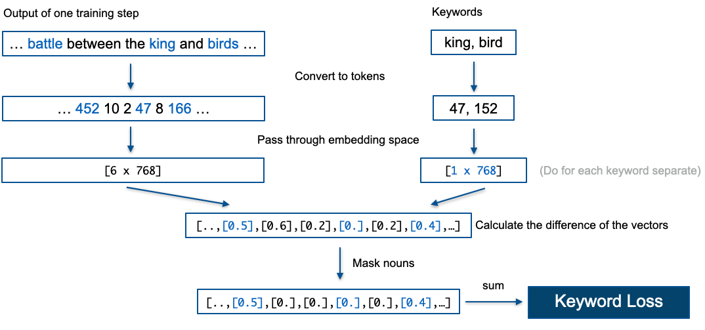

# Bedtime Stories

This repositories can be separated in three different areas:
1. A server api using fastapi and a mysql database which allows to save and load
   models from and to the server. Moreover predictions can be saved to the
   database as well. (Look at [main.py](api/main.py) and api/db )
2. There are tools provided for bedtime story generation. The provided models
   finetune the GPT-2 with bedtime stories. The models can be found in
   api/ml/models. The GPT2Keyword model is a bit more advanced and changes the
   loss function. It can generate text output which is based on given keywords. 
   Each implemented model inherits from the Model class defined
   in [model.py](api/ml/models/model.py). It is easy to add further models and
   benefit from methods for uploading and downloading models from the server.
3. An alexa bedtime skill where the user is able to ask for bedtime stories
   which are saved to the database. With lighter models than the GPT2 the
   project structure would also make it possible to do live predictions. 

An Example for using the project in colab can be found here: 

## Project setup for the ml
1. Create the virtual environment.
```
virtualenv /path/to/venv --python=/path/to/python3
```
You can find out the path to your `python3` interpreter with the command `which python3`.

2. Activate the environment and install dependencies.
```
source /path/to/venv/bin/activate
pip install -r requirements.txt
```

3. Training for example the GPT2Tuned model
```
cd api/ml/
pyhton -m models.GPT2Tuned
```

4. Training a model and saving it to the server
```python
from models.GPT2Keywords import GPT2Keywords

# changing hyperparameters
parameters = {"block_size": 400, "labels_same_as_input": False, "mask_nouns": False, "keyword_loss_weight": 1e-5, "num_train_epochs": 3, "load_best_model": True}

model = GPT2Keywords(model_id="XYZ", parameters=parameters, server="http://localhost:8000")
model.train()
# save locally
model.save()
# saves the model weights and parameters to the server
# the model loader can be used to load the model again
model.save_to_server(save_files=True)
```

## GPT2Keyword
[](https://colab.research.google.com/drive/1qbZ4TXzOWvVvNsylIUIjy15Lz0Tox1DV?usp=sharing)

The training of the GPT2Keyword model is illustrated in the following:


The loss function is changed in order to penalize if the keywords are not in the
 created text. This additional loss is weighted with the "keyword_loss_weight"
 parameter. The computation of the loss is shown in the following:



Here is a list of all available training hyperparameters:

| Parameter      | Default      | Description     |
| ------------- | ---------- | ----------- |
| block_size | 200  | how many words should a sequence have |
| num_train_epochs | 3 | number of training epochs |
| learning_rate| 5e-5 | the learning rate of the GPT2 model |
| keyword_loss_weight | 1e-4 | how the keyword loss is weighted|
| load_best_model | false | load best model at the end (disadvantage has to save each training step) |
| mask_nouns | true | whenever to mask the words before calculating the similarity (takes much longer because of the use of spacy to detect whenever the word is a noun)|
| labels_same_as_input | false | how to create the labels: if true the inputs and the labels to the GPT are the same, otherwise the labels are padded with <\|bed\|> instead adding the keywords in the beginning as shown in the image|
| cos_similarity | false | use the cos similarity measure instead the distance of the embedding vectors to calculate the difference between keywords and text |
| add_space | false | Add a space to each keyword (GPT tokenizer uses different tokens for the same word depending if a trailing space exist)|
| only_grimm | false | To use only the small fairytales grimm dataset|

## GPT2Tuned

[](https://colab.research.google.com/drive/18wGb5Jx8couTY_ybk4sbt68ZjR7fWkt3?usp=sharing)

The GPT2Tuned model is a normal GPT-2 model fine tuned with our story dataset.
You can use the predict method with a simple prompt to make predictions:

```python
model.predict("Once upon a time there was a cat", max_length=100)
```

To train the model you can call the `train()` method. It will load the dataset
and perform fine tuning. The following training hyperparameters are available:

| Parameter      | Default      | Description     |
| ------------- | ---------- | ----------- |
| num_train_epochs | 3 | number of training epochs |
| learning_rate| 5e-5 | the learning rate of the GPT2 model |
| logging_steps | 500 | after how many steps to perform logging|
| save_steps | 500 | after how many steps to save the model|
| save_total_limit | None | how many model saves to keep in total|

## docker-compose for the server api
The project consists of two docker images. One image serves the mysql server and
the other one is the server api with fastapi. Since the methods of the
fastapi server depends on the database it does not make sense to start that image
separately.

1. Launching the service and building docker images new
```
docker-compose up --build
```

2. Just launching the service
```
docker-compose up
```

3. Stopping the service
```
docker-compose down
```

4. Stopping the service and removing the data e.g. database
```
docker-compose down -v
```

5. Connect to mysql instance in docker container
```
docker run -it --entrypoint #id /bin/bash
mysql -u bedtime -p
```

## Posting requests locally
When the service is running, you can see all available methods under the
following webpage from fastapi. It is even possible to test the methods. 
```
127.0.0.1:8000/docs
```
Request can also be done with
```
curl
```

# Model Loader Usage

To load a model locally you can use the model loader like this:
```python
from model_loader import ModelLoader

model_loader = ModelLoader("XYZ", "http://localhost:8000")
model = model_loader.get_model()
```

You can now use the model like it was trained locally:
```python
pred = model.predict("Once upon a time there was", keywords=['boat', 'dog'], max_length=300)
```

## Some sample outputs with GPT2Keyword

Input keywords: "boat, dog"
>Once upon a time there was a boat and a dog, and the dog was very fond of them.
>One day, when they were sitting in the boat, they said to each other: 'We are
>going to the sea to seek our fortune, for we have a long way to go before we
>reach the land of the Living Sea.' The dog said: ‘I will go and seek my
>fortune.’ The boat replied:‘Yes, we shall go, but first we must first find a
>way out of this terrible place, so that we may be able to find our way home
>again. We shall be very careful not to let any one come near us, as we know
>that if we do, he will kill us.' So they all set out on their way. When they
>reached the shore they found a great lake, full of water. They looked about
>them and saw that it was covered with a thicket of trees. Then they thought to
>themselves: If we could only find the way we had come to this place! They went
>on and on, till at last they came to a little island, which was surrounded by a
>wide sea. It was so small that they could hardly see it. At the bottom of it
>they saw a huge fish swimming about in a pool. The fish was as big as a man and
>had a tail like that of a giant. He had three heads, one on each side of his
>body.

Input keywords: "king, father"
>Once upon a time there was a king who had three sons. One of them was the son
>of a merchant, and the other was his son-in-law. The king's son was very fond
>of his father, for he had a great deal of money, but he did not like to spend
>it on anything else, so he went to the king and said to him, 'If you will give
>me a piece of gold, I will take it to you and give you a hundred pieces of
>silver.' So he took the gold and gave him to his eldest son, who was much more
>clever than he was. When he saw that his brother was so clever, he thought to
>himself, Why should he not give him the money that was in his pocket, if he
>could get it for himself' 'Why should I give my brother the silver' he said.
>'Because he is a clever man. He has no money to give to anyone else. If he
>wants to get a thousand pieces, let him.' 'I will do that,' said the eldest
>brother; 'and if I want to have a million pieces for myself, give them to my
>son.' And he gave the second son the hundred gold pieces. Then the third son
>said, What is the matter with you' And the youngest son answered, Well, it is
>nothing at all. But the elder brother thought, If I can get my brothers' money
>for themselves, then I shall be able to ...

## Contributors
**Bastian Hofmann, Michael Günther**<br>
The projected was created in the Applied Deep Learning for NLP course at the TUM
by Juan Carlos Medina Serrano.